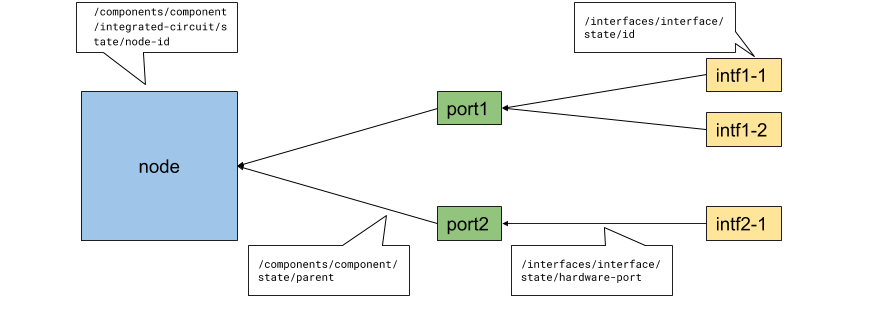

# Hercules data model extensions

Hercules extends the OpenConfig model with new data elements that are required
for SDN management of switches. Extensions are in the form of additional YANG
modules that augment existing parts of the OpenConfig model, or add new subtrees
to the model. This document provides an overview of the model structure and
extensions.

## Hercules model structure

Hercules leverages the component model described by the OpenConfig platform
model, as well as several logical elements including interfaces, QoS, and L2
protocols. The diagram below summarizes the model elements.


Hercules defines a standard physical component hierarchy consisting of `chassis
-> linecard -> node -> port`. Nodes are generally implemented by a switching
ASIC, which in turn manages multiple physical ports. As with the base OpenConfig
model, a physical port gives rise to one or more logical interfaces, depending
on whether port channelization is in effect. The layout is illustrated below.


## Discovery of Node-Interface Mapping

For multi-node chassis, even though the gNMI subscription is per-chassis, some
SDN controllers' architecture is aligned with the "node" entity. Such controller
needs to understand which interfaces belong to which node, so that it can
demultiplex the gNMI messages to each node.

In Hercules, the 32-bit `/interfaces/interface/state/id` (i.e. the SDN port
number) is not guaranteed to be unique across chassis: two nodes on the same
chassis may have different interfaces with the same SDN port number. Therefore,
the controller can not simply rely on the `/interfaces/interface/state/id` path
to map interfaces to nodes. Instead, the controller constructs a mapping by
subscribing to several paths that associate nodes, ports and interfaces.

### Paths Used for Node-Interface Mapping

The Subscribe request contains the following paths to build the node-interface
mapping:

```
/components/component[name=*]/integrated-circuit/state/node-id
/components/component[name=*]/state/parent
/interfaces/interface[name=*]/state/hardware-port
/interfaces/interface[name=*]/state/id
```



-   By subscribing to the `node-id` leaf, the mapping between the 64-bit integer
    ID of the nodes (`node-id`) to the component name for the node (the `name`
    key) is discovered.
-   By subscribing to the `parent` leaf, the mapping between a component's name
    (`parent`) to its subcomponents' names (the `name` key) is discovered. From
    this, the controller can learn the mapping from node component name to its
    port component names.
-   By subscribing to the `hardware-port` leaf, the mapping between a port
    component name (`hardware-port`) to the interface names (the `name` key) is
    discovered. One hardware port may contain more than one interface if it is a
    multi-channel port.
-   By subscribing to the `id` leaf, the mapping between the 32-bit SDN port
    number (`id`) to the interface names (the `name` key) is discovered. This
    allows the controller to verify if the discovered interfaces are consistent
    with the controller's configuration.

After getting the response of these subscriptions, the controller build maps
from node ID to node component name, then maps node component name to port
component name, then maps port component name to interface name, then maps
interface name to interface ID. Combining these mappings, the controller gets
the `node-id` -> (interface name, interface ID) mapping. After that, the
controller is able to demultiplex the gNMI responses to each nodes.
