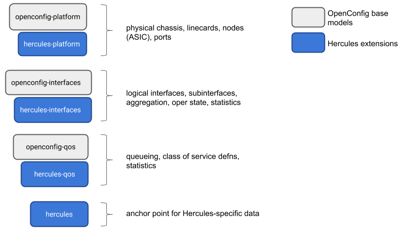

# Hercules data model extensions

Hercules extends the OpenConfig model with new data elements that are required
for SDN management of switches.  Extensions are in the form of additional YANG
modules that augment existing parts of the OpenConfig model, or add new subtrees
to the model.  This document provides an overview of the model structure and
extensions.

## Hercules model structure

Hercules leverages the component model described by the OpenConfig
platform model, as well as several logical elements including interfaces, QoS,
and L2 protocols.  The diagram below summarizes the model elements.

Hercules defines a standard physical component hierarchy consisting of `chassis
-> linecard -> node -> port`.  Nodes are generally implemented by a switching
ASIC, which in turn manages multiple physical ports.  As with the base
OpenConfig model, a physical port gives rise to one or more logical interfaces,
depending on whether port channelization is in effect.  The layout is
illustrated below.

## Summary of model extensions

### openconfig-hercules-platform

`openconfig-hercules-platform.yang` consists of a number of submodules that add data elements to each of the components in the Hercules switch platform hierarchy (i.e., chassis, linecard, node, port).

| Path | Description |
| ---- | :---------- |
`/components/component/config/type` | The component type is a read-only value in the base model, however the SDN configuration system may need to set the type of component (e.g., to preconfigure a system and validate that it was correctly deployed).
`/components/component/chassis/[config\|state]`/platform | This identity specifies the type of Hercules chassis.  The initial model defines a GENERIC type, but implementors may extend this with additional values.
`/components/component/chassis/alarms/memory-error/` | This is an exception raised when the switch detects an uncorrectable memory corruption error.
`/components/component/chassis/alarms/flow-programming-exception/` | This exception is raised when the switch is unable to complete a flow programming instruction from the SDN controller.  It may be caused by a hardware error or a software exception.
`/components/component/linecard/config/config/slot-id` | The slot-id is a read-only value in the base linecard component model, however the SDN management system may need to assign the slot ID to the linecard via configuration.
`/components/component/integrated-circuit/[config\|state]/node-id` | Each node (i.e., switching ASIC) is addressed by the controller or configuration manager based on its numeric identifier (which can be assigned through configuration).  In order to effectively manage port availability, for example, it is important for the controller to understand which ports are managed by which nodes.
`/components/component/integrated-circuit/vendor-data/[config\|state]` | This is an anchor container for defining augmentations that add ASIC-specific data to the model.
`/components/component/port/[config\|state]/port-id` | A numeric identifier for the physical port.

### openconfig-hercules-interfaces

`openconfig-hercules-interfaces.yang` augments the logical interfaces model (both base interface and Ethernet portion).

| Path | Description |
| ---- | :---------- |
`/interfaces/interface/[config\|state]/health-indicator` | This is used by the controller to set a simple visual indicator for an interface (typically an LED) to assist operations or maintenance teams to identify a faulty interface.  A switch implementation may map `GOOD` and `BAD` values to appropriate LED colors, for example red and green, respectively, on the physical port corresponding to the interface.
`/interfaces/interface/ethernet/[config\|state]/forwarding-viable` | This is used by the controller to disable an interface (usually part of an aggregate) for the purposes of forwarding traffic.  This allows a logical aggregate to continue to be used with partial capacity, for example.  Note that setting `forwarding-viable = false` is not equivalent to administratively disabling the interface -- in particular, the interface is expected to participate in L2 protocols such as LLDP or LACP even if it blocked from forwarding traffic.

### openconfig-hercules-qos

`openconfig-hercules-qos.yang` augments the base OpenConfig QoS model with additional parameters for Hercules switches.

| Path | Description |
| ---- | :---------- |
`/qos/queues/queue/[config\|state]/id` | The SDN controller addresses queues using a numeric id -- this allows the controller to map the queue name to its SDN queue id which can be assigned by the configuration manager.
`/qos/interfaces/interface/[input\|output]/queues/queue/state/id` | This is a read-only value to indicate the id of a input or output queue associated with an interface.
