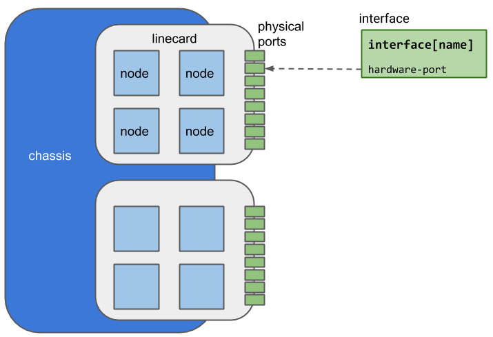

# Hercules data model extensions

Hercules extends the OpenConfig model with new data elements that are required
for SDN management of switches.  Extensions are in the form of additional YANG
modules that augment existing parts of the OpenConfig model, or add new subtrees
to the model.  This document provides an overview of the model structure and
extensions.

## Hercules model structure

Hercules leverages the component model described by the OpenConfig
platform model, as well as several logical elements including interfaces, QoS,
and L2 protocols.  The diagram below summarizes the model elements.

Hercules defines a standard physical component hierarchy consisting of `chassis
-> linecard -> node -> port`.  Nodes are generally implemented by a switching
ASIC, which in turn manages multiple physical ports.  As with the base
OpenConfig model, a physical port gives rise to one or more logical interfaces,
depending on whether port channelization is in effect.  The layout is
illustrated below.

